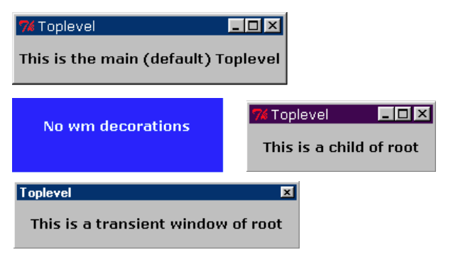
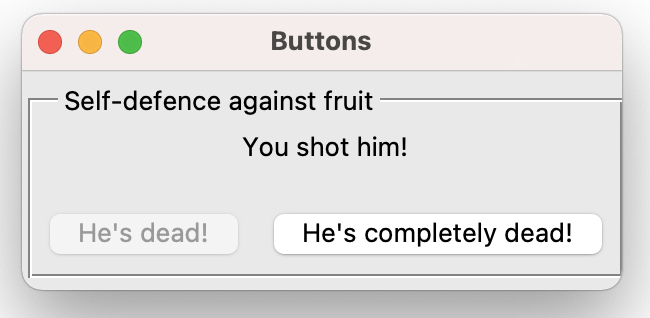

# tkinter常用介面類別

## topLevel

```python
from Tkinter import *

root = Tk()
root.option_readfile('optionDB')
root.title('Toplevel')
Label(root, text='This is the main (default) Toplevel').pack(pady=10)
t1 = Toplevel(root)
Label(t1, text='This is a child of root').pack(padx=10, pady=10)
t2 = Toplevel(root)
Label(t2, text='This is a transient window of root').pack(padx=10, pady=10)
t2.transient(root)
t3 = Toplevel(root, borderwidth=5, bg='blue')
Label(t3, text='No wm decorations', bg='blue', fg='white').pack(padx=10, pady=10)
t3.overrideredirect(1)
t3.geometry('200x70+150+150')
root.mainloop()
```



---

## Frame
Frame內可以包含Frame或其它顯示類別!,Frame如果以口語化的解釋為'一組有關係的介面被包含在相同的Frame內`，如果一個視窗應用程式內，被區分為5個功能區域，則可建立5個Frame,每個Frame內有自已的顯示介面

```python
from tkinter import *

root = Tk()
root.title('Frames')
for relief in [RAISED, SUNKEN, FLAT, RIDGE, GROOVE, SOLID]:
    f = Frame(root, borderwidth=2, relief=relief)
    Label(f, text=relief, width=10).pack(side=LEFT)
    f.pack(side=LEFT, padx=5, pady=5)        

root.mainloop()

```


---

```python
from tkinter import *

class GUI:
    def __init__(self):
        self.root = Tk()
        self.root.title('Frame Styles')
        for bdw in range(5):
            setattr(self, 'of%d' % bdw, Frame(self.root, borderwidth=0))
            Label(getattr(self, 'of%d' % bdw),
                  text='borderwidth = %d  ' % bdw).pack(side=LEFT)
            ifx = 0
            for relief in [RAISED, SUNKEN, FLAT, RIDGE, GROOVE, SOLID]:
                setattr(self, 'f%d' % ifx, Frame(getattr(self, 'of%d' % bdw),
                                                 borderwidth=bdw, relief=relief))
                Label(getattr(self, 'f%d' % ifx), text=relief, width=10).pack(side=LEFT)
                getattr(self, 'f%d' % ifx).pack(side=LEFT, padx=7-bdw, pady=5+bdw)
                ifx = ifx+1
            getattr(self, 'of%d' % bdw).pack()

myGUI = GUI()
myGUI.root.mainloop()
```


---

```python
from tkinter import *

root = Tk()
root.title('Buttons')
f = Frame(root, width=300, height=110)
xf = Frame(f, relief=GROOVE, borderwidth=2)
Label(xf, text="You shot him!").pack(pady=10)
Button(xf, text="He's dead!", state=DISABLED).pack(side=LEFT, padx=5, pady=8)
Button(xf, text="He's completely dead!", command=root.quit).pack(side=RIGHT,                                                                 padx=5, pady=8)
xf.place(relx=0.01, rely=0.125, anchor=NW)
Label(f, text='Self-defence against fruit').place(relx=.06, rely=0.125,anchor=W)
f.pack()
root.mainloop()
```



---


