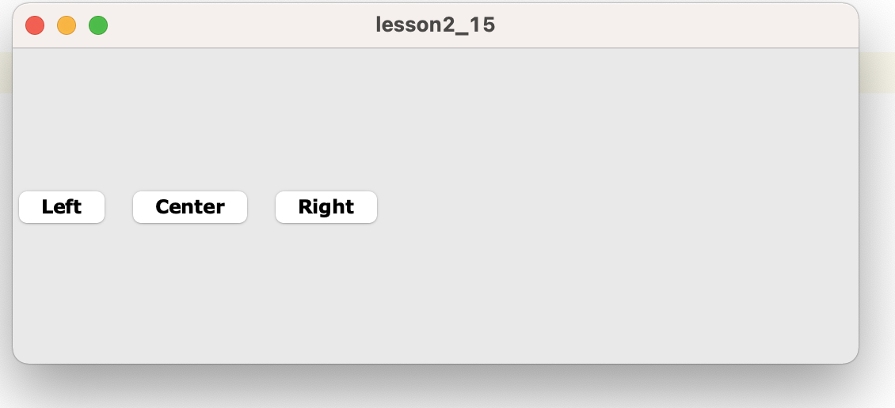
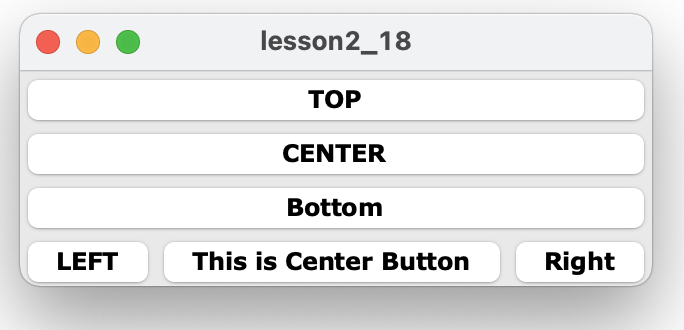
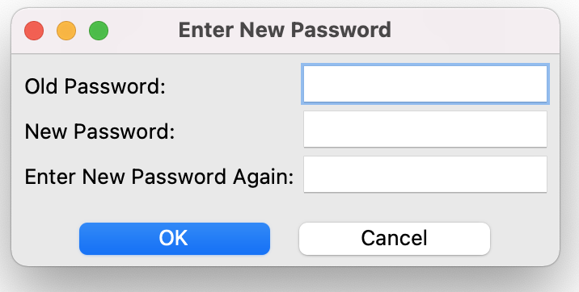
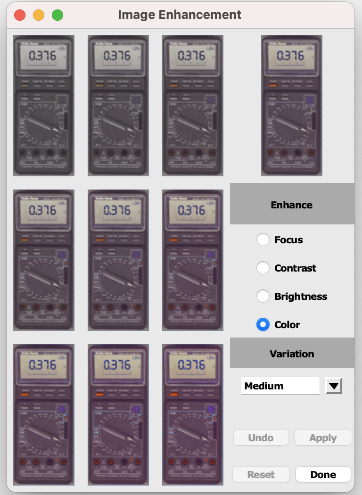
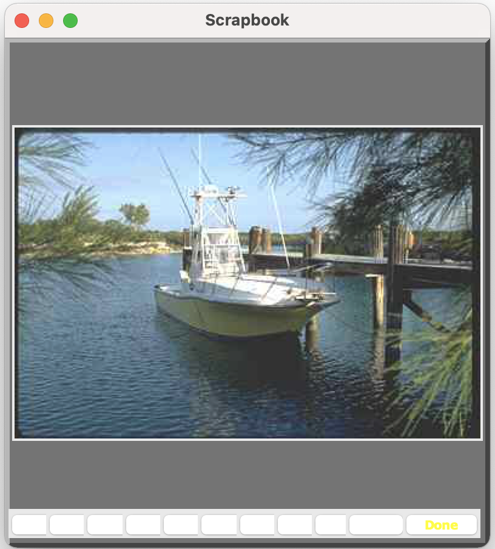

# 版面
- Pack
- Grid
- Place
## Packer

```python
#lesson2_1

import tkinter as tk
from tkinter import Button
from tkinter import *

class Window(tk.Tk):
    def __init__(self):
        super().__init__()
        self.option_add('*font',('verdana', 12, 'bold'))
        self.title("lesson2_1")

        Button(self, text='Left').pack(side=LEFT)
        Button(self, text='Center').pack(side=LEFT)
        Button(self, text='Right').pack(side=LEFT)

if __name__ == "__main__":
    window = Window()
    window.mainloop()
```


---

```python
import tkinter as tk
from tkinter import *

class Window(tk.Tk):
    def __init__(self):
        super().__init__()
        self.option_add('*font',('verdana', 12, 'bold'))
        self.title("lesson2_2")

        Button(self, text='Left').pack(side=LEFT)
        Button(self, text='This is th Center button').pack(side=LEFT)
        Button(self, text='Right').pack(side=LEFT)

if __name__ == "__main__":
    window = Window()
    window.mainloop()
```


---

```python
import tkinter as tk
from tkinter import *

class Window(tk.Tk):
    def __init__(self):
        super().__init__()
        self.option_add('*font',('verdana', 12, 'bold'))
        self.title("lesson2_3")

        Button(self, text='Top').pack(side=TOP)
        Button(self, text='This is th Center button').pack(side=TOP)
        Button(self, text='Bottom').pack(side=TOP)

if __name__ == "__main__":
    window = Window()
    window.mainloop()
```

	

---

```python
import tkinter as tk
from tkinter import *

class Window(tk.Tk):
    def __init__(self):
        super().__init__()
        self.option_add('*font',('verdana', 12, 'bold'))
        self.title("lesson2_4")

        fm = Frame(self)
        Button(self, text='Left').pack(side=TOP)
        Button(self, text='Center').pack(side=LEFT)
        Button(self, text='Right').pack(side=LEFT)
        fm.pack()

if __name__ == "__main__":
    window = Window()
    window.mainloop()
```

	

---

```python
import tkinter as tk
from tkinter import *

class Window(tk.Tk):
    def __init__(self):
        super().__init__()
        self.option_add('*font',('verdana', 12, 'bold'))
        self.title("lesson2_5")

        fm = Frame(self,width=300, height=200)
        Button(self, text='Left').pack(side=LEFT)
        Button(self, text='Center').pack(side=LEFT)
        Button(self, text='Right').pack(side=LEFT)
        fm.pack()

if __name__ == "__main__":
    window = Window()
    window.mainloop()
```

	

---

### 使用expand

```python
import tkinter as tk
from tkinter import *

class Window(tk.Tk):
    def __init__(self):
        super().__init__()
        self.option_add('*font',('verdana', 12, 'bold'))
        self.title("lesson2_6")
        self.geometry("300x200")

        fm = Frame(self)
        Button(self, text='Left').pack(side=LEFT)
        Button(self, text='Center').pack(side=LEFT)
        Button(self, text='Right').pack(side=LEFT)
        fm.pack(fill=BOTH, expand=YES)

if __name__ == "__main__":
    window = Window()
    window.mainloop()
```

	

---

```python
import tkinter as tk
from tkinter import *

class Window(tk.Tk):
    def __init__(self):
        super().__init__()
        self.option_add('*font',('verdana', 12, 'bold'))
        self.title("lesson2_7")
        self.geometry("300x200")

        fm = Frame(self)
        Button(self, text='Left').pack(side=LEFT, expand=YES)
        Button(self, text='Center').pack(side=LEFT, expand=YES)
        Button(self, text='Right').pack(side=LEFT, expand=YES)
        fm.pack(fill=BOTH, expand=YES)

if __name__ == "__main__":
    window = Window()
    window.mainloop()
```


---

```python
import tkinter as tk
from tkinter import *

class Window(tk.Tk):
    def __init__(self):
        super().__init__()
        self.option_add('*font',('verdana', 12, 'bold'))
        self.title("lesson2_8")
        self.geometry("300x200")

        fm = Frame(self)
        Button(self, text='Top').pack(side=TOP, expand=YES)
        Button(self, text='Center').pack(side=TOP, expand=YES)
        Button(self, text='Bottom').pack(side=TOP, expand=YES)
        fm.pack(fill=BOTH, expand=YES)

if __name__ == "__main__":
    window = Window()
    window.mainloop()
```	


---

### 使用fill

```python
import tkinter as tk
from tkinter import *

class Window(tk.Tk):
    def __init__(self):
        super().__init__()
        self.option_add('*font',('verdana', 12, 'bold'))
        self.title("lesson2_9")
        self.geometry("300x200")

        fm = Frame(self)
        Button(self, text='Left').pack(side=LEFT, expand=YES,fill=X)
        Button(self, text='Center').pack(side=LEFT, expand=YES,fill=X)
        Button(self, text='Right').pack(side=LEFT, expand=YES,fill=X)
        fm.pack(fill=BOTH, expand=YES)

if __name__ == "__main__":
    window = Window()
    window.mainloop()
```


---

```python
import tkinter as tk
from tkinter import *

class Window(tk.Tk):
    def __init__(self):
        super().__init__()
        self.option_add('*font',('verdana', 12, 'bold'))
        self.title("lesson2_10")
        self.geometry("300x200")

        fm = Frame(self)
        Button(self, text='Top').pack(side=TOP, fill=X)
        Button(self, text='Center').pack(side=TOP, fill=X)
        Button(self, text='Bottom').pack(side=TOP, fill=X)
        fm.pack(fill=BOTH, expand=YES)

if __name__ == "__main__":
    window = Window()
    window.mainloop()
```


---

```python
import tkinter as tk
from tkinter import *

class Window(tk.Tk):
    def __init__(self):
        super().__init__()
        self.option_add('*font',('verdana', 12, 'bold'))
        self.title("lesson2_11")
        self.geometry("300x200")

        fm = Frame(self)
        Button(self, text='Left').pack(side=LEFT, expand=NO,fill=X)
        Button(self, text='Center').pack(side=LEFT, expand=NO,fill=X)
        Button(self, text='Right').pack(side=LEFT, expand=YES,fill=X)
        fm.pack(fill=BOTH, expand=YES)

if __name__ == "__main__":
    window = Window()
    window.mainloop()
```


---

```python
import tkinter as tk
from tkinter import *

class Window(tk.Tk):
    def __init__(self):
        super().__init__()
        self.option_add('*font',('verdana', 12, 'bold'))
        self.title("lesson2_12")
        self.geometry("300x200")

        fm = Frame(self)
        Button(self, text='Left').pack(side=TOP, expand=YES,fill=X)
        Button(self, text='Center').pack(side=TOP, expand=YES,fill=X)
        Button(self, text='Right').pack(side=TOP, expand=YES,fill=X)
        fm.pack(fill=BOTH, expand=YES)

if __name__ == "__main__":
    window = Window()
    window.mainloop()
```


---

```python
import tkinter as tk
from tkinter import *

class Window(tk.Tk):
    def __init__(self):
        super().__init__()
        self.option_add('*font',('verdana', 12, 'bold'))
        self.title("lesson2_13")
        self.geometry("300x200")

        fm = Frame(self)
        Button(self, text='Left').pack(side=LEFT, expand=YES,fill=BOTH)
        Button(self, text='Center').pack(side=LEFT, expand=YES,fill=BOTH)
        Button(self, text='Right').pack(side=LEFT, expand=YES,fill=BOTH)
        fm.pack(fill=BOTH, expand=YES)

if __name__ == "__main__":
    window = Window()
    window.mainloop()
```


---

```python
import tkinter as tk
from tkinter import *

class Window(tk.Tk):
    def __init__(self):
        super().__init__()
        self.option_add('*font',('verdana', 12, 'bold'))
        self.title("lesson2_14")
        self.geometry("300x200")

        fm = Frame(self)
        Button(self, text='TOP').pack(side=TOP, expand=YES,fill=BOTH)
        Button(self, text='Center').pack(side=TOP, expand=YES,fill=BOTH)
        Button(self, text='Bottom').pack(side=TOP, expand=YES,fill=BOTH)
        fm.pack(fill=BOTH, expand=YES)

if __name__ == "__main__":
    window = Window()
    window.mainloop()
```


---

### 使用padx和pady

```python
import tkinter as tk
from tkinter import *

class Window(tk.Tk):
    def __init__(self):
        super().__init__()
        self.option_add('*font',('verdana', 12, 'bold'))
        self.title("lesson2_15")

        fm = Frame(self,width=300, height=200)
        Button(self, text='Left').pack(side=LEFT)
        Button(self, text='Center').pack(side=LEFT, padx=10)
        Button(self, text='Right').pack(side=LEFT)
        fm.pack()

if __name__ == "__main__":
    window = Window()
    window.mainloop()
```



---

### 使用anchor

```python
import tkinter as tk
from tkinter import *

class Window(tk.Tk):
    def __init__(self):
        super().__init__()
        self.option_add('*font',('verdana', 12, 'bold'))
        self.title("lesson2_16")
        self.geometry("300x200")
        fm = Frame(self)
        Button(fm, text='side=TOP, anchor=W').pack(side=TOP,expand=YES, anchor=W)
        Button(fm, text='side=TOP, anchor=W').pack(side=TOP,expand=YES, anchor=W)
        Button(fm, text='side=TOP, anchor=W').pack(side=TOP,expand=YES, anchor=W)
        fm.pack(fill=BOTH, expand=YES)

if __name__ == "__main__":
    window = Window()
    window.mainloop()
```


---

```python
import tkinter as tk
from tkinter import *

class Window(tk.Tk):
    def __init__(self):
        super().__init__()
        self.option_add('*font',('verdana', 12, 'bold'))
        self.title("lesson2_17")
        self.geometry("300x200")
        fm = Frame(self)
        Button(fm, text='side=TOP, anchor=W').pack(side=TOP,expand=YES, anchor=W)
        Button(fm, text='side=TOP, anchor=W').pack(side=TOP,expand=YES, anchor=W)
        Button(fm, text='side=TOP, anchor=W').pack(side=TOP,expand=YES, anchor=W)
        fm.pack(fill=BOTH, expand=YES)

if __name__ == "__main__":
    window = Window()
    window.mainloop()
```


---

```python
import tkinter as tk
from tkinter import *

class Window(tk.Tk):
    def __init__(self):
        super().__init__()
        self.option_add('*font',('verdana', 12, 'bold'))
        self.title("lesson2_18")

        fm = Frame(self)
        Button(fm, text='TOP').pack(side=TOP,expand=YES, anchor=W,fill=X)
        Button(fm, text='CENTER').pack(side=TOP,expand=YES, anchor=W,fill=X)
        Button(fm, text='Bottom').pack(side=TOP,expand=YES, anchor=W,fill=X)
        Button(fm, text='LEFT').pack(side=LEFT)
        Button(fm, text='This is Center Button').pack(side=LEFT)
        Button(fm, text='Right').pack(side=LEFT)
        fm.pack(fill=BOTH, expand=YES)

if __name__ == "__main__":
    window = Window()
    window.mainloop()
```



---

```python
import tkinter as tk
from tkinter import *

class Window(tk.Tk):
    def __init__(self):
        super().__init__()
        self.option_add('*font',('verdana', 12, 'bold'))
        self.title("lesson2_19")

        fm = Frame(self)
        Button(fm, text='TOP').pack(side=TOP,expand=YES, anchor=W,fill=X)
        Button(fm, text='CENTER').pack(side=TOP,expand=YES, anchor=W,fill=X)
        Button(fm, text='Bottom').pack(side=TOP,expand=YES, anchor=W,fill=X)
        fm.pack(side=LEFT, fill=BOTH, expand=YES)

        fm1 = Frame(self)
        Button(fm1, text='LEFT').pack(side=LEFT)
        Button(fm1, text='This is Center Button').pack(side=LEFT)
        Button(fm1, text='Right').pack(side=LEFT)
        fm1.pack(side=LEFT, padx=10)

if __name__ == "__main__":
    window = Window()
    window.mainloop()
```


---

## Grid
```python
from tkinter import *
from tkinter.simpledialog import Dialog
from tkinter import messagebox


class GetPassword(Dialog):

    def body(self, master):
        self.title("Enter New Password")

        Label(master, text='Old Password:').grid(row=0, sticky=W)
        Label(master, text='New Password:').grid(row=1, sticky=W)
        Label(master, text='Enter New Password Again:').grid(row=2, sticky=W)

        self.oldpw = Entry(master, width=16, show='*')
        self.newpw1 = Entry(master, width=16, show='*')
        self.newpw2 = Entry(master, width=16, show='*')

        self.oldpw.grid(row=0, column=1, sticky=W)
        self.newpw1.grid(row=1, column=1, sticky=W)
        self.newpw2.grid(row=2, column=1, sticky=W)
        return self.oldpw

    def apply(self):
        opw = self.oldpw.get()
        npw1 = self.newpw1.get()
        npw2 = self.newpw2.get()

        if not npw1 == npw2:
            messagebox.showerror('Bad Password',
                                   'New Passwords do not match')
        else:
            # This is where we would set the new password...
            pass


root = Tk()
dialog = GetPassword(root)
```



---

範例使用前先安裝:
```
$ pip install Pillow
$ pip install Pmw
```

```python
from tkinter import *
from PIL import Image, ImageTk, ImageEnhance
import sys, Pmw


class Enhancer:
    def __init__(self, master=None, imgfile=None):
        self.master = master
        self.masterImg = Image.open(imgfile)
        self.masterImg.thumbnail((150, 150))

        for i in range(9):
            image = self.masterImg.copy()
            setattr(self, 'image%d' % i, image)
            setattr(self, 'img%d' % i, ImageTk.PhotoImage(image.mode,
                                                          image.size))
        i = 0
        for r in range(3):
            for c in range(3):
                lbl = Label(master, image=getattr(self, 'img%d' % i))
                setattr(self, 'lbl%d' % i, lbl)
                getattr(self, 'lbl%d' % i).grid(row=r * 5, column=c * 2,
                                                rowspan=5, columnspan=2,
                                                sticky=W + E + S + N, padx=5, pady=5)
                i = i + 1

        self.original = ImageTk.PhotoImage(self.masterImg)
        Label(master, image=self.original).grid(row=0, column=6,
                                                rowspan=5, columnspan=2)

        Label(master, text='Enhance', bg='gray70').grid(row=5, column=6,
                                                        columnspan=2, sticky=N + S + W + E)
        self.radio = Pmw.RadioSelect(master, labelpos=None,
                                     buttontype='radiobutton', orient='vertical',
                                     command=self.selectFunc)
        self.radio.grid(row=6, column=6, rowspan=4, columnspan=2)

        self.varFactor = 0.2
        self.enh = {}
        for lbl, enh in (('Focus', ImageEnhance.Sharpness),
                         ('Contrast', ImageEnhance.Contrast),
                         ('Brightness', ImageEnhance.Brightness),
                         ('Color', ImageEnhance.Color)):
            self.radio.add(lbl)
            self.enh[lbl] = enh
        self.radio.invoke('Color')
        self.currentEnh = self.enh['Color']

        Label(master, text='Variation', bg='gray70').grid(row=10, column=6,
                                                          columnspan=2, sticky=N + S + W + E)

        self.variation = Pmw.ComboBox(master, history=0, entry_width=11,
                                      selectioncommand=self.setVariation,
                                      scrolledlist_items=('Fine', 'Medium Fine', 'Medium',
                                                          'Medium Course', 'Course'))
        self.variation.selectitem('Medium')
        self.variation.grid(row=11, column=6, columnspan=2)

        Button(master, text='Undo', state='disabled').grid(row=13, column=6)
        Button(master, text='Apply', state='disabled').grid(row=13, column=7)
        Button(master, text='Reset', state='disabled').grid(row=14, column=6)
        Button(master, text='Done', command=self.exit).grid(row=14, column=7)

    def exit(self):
        self.master.destroy()

    def selectFunc(self, tag):
        self.currentEnh = self.enh[tag]
        self.doEnhancement()

    def setVariation(self, tag):
        self.varFactor = {'Fine': 0.05, 'Medium Fine': 0.1,
                          'Medium': 0.2, 'Medium Course': 0.3,
                          'Course': 0.5}[tag]
        self.doEnhancement()

    def doEnhancement(self):
        values = []
        for i in range(5):
            values.append(1.0 - (i * self.varFactor))
        values.reverse()
        for i in range(4):
            values.append(1.0 + ((i + 1) * self.varFactor))

        i = 0
        for v in values:
            enhancer = self.currentEnh(getattr(self, 'image%d' % i))
            getattr(self, 'img%d' % i).paste(enhancer.enhance(v))
            i = i + 1


root = Tk()
root.option_add('*font', ('verdana', 10, 'bold'))
root.title('Image Enhancement')
imgEnh = Enhancer(root, sys.argv[1])
root.mainloop()
```

> 注意:

> 目錄內要有一張圖片
> 執行時要有參數



---
## Placer

```python
from tkinter import *
from PIL import Image, ImageTk
import os


class Scrapbook:
    def __init__(self, master=None):
        self.master = master
        self.frame = Frame(master, width=400, height=420, bg='gray50',
                           relief=RAISED, bd=4)

        self.lbl = Label(self.frame)
        self.lbl.place(relx=0.5, rely=0.48, anchor=CENTER)

        self.images = []
        images = os.listdir("./images")

        xpos = 0.05
        for i in range(10):
            Button(self.frame, text='%d' % (i + 1), bg='gray10',
                   fg='white', command=lambda s=self, img=i: \
                    s.getImg(img)).place(relx=xpos, rely=0.99, anchor=S)
            xpos = xpos + 0.08
            self.images.append(images[i])

        Button(self.frame, text='Done', command=self.exit,
               bg='red', fg='yellow').place(relx=0.99, rely=0.99, anchor=SE)
        self.frame.pack()
        self.getImg(0)

    def getImg(self, img):
        self.masterImg = Image.open(os.path.join("./images",
                                                 self.images[img]))
        self.masterImg.thumbnail((400, 400))
        self.img = ImageTk.PhotoImage(self.masterImg)
        self.lbl['image'] = self.img

    def exit(self):
        self.master.destroy()

    def selectFunc(self, tag):
        pass


root = Tk()
root.option_add('*font', ('verdana', 10, 'bold'))
root.title('Scrapbook')
scrapbook = Scrapbook(root)
root.mainloop()

```

> 注意:

> 目錄內要有images的目錄，並且有圖片




